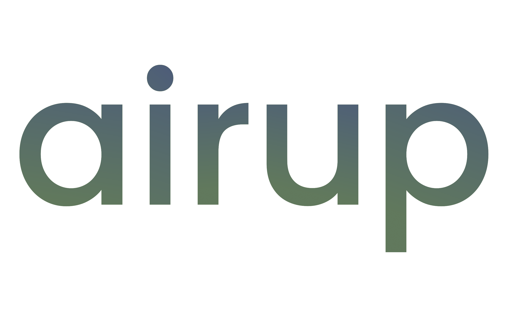

# Airup

Airup is a modern, portable and fast implementation of daemon supervisors and the `init` daemon.

## Project Status
Maintained Versions:
 - Current Mainline Version: `0.4.0-alpha.1`
 - Current Release Version: `0.3.1`

*WARNING*: The project is currently in *unstable* stage and should *NOT* be used in production environments. It may contain
errors, bugs or quality issues. Welcome to open an issue to report bugs.

## Documentation
[Multilingua documentation](docs/README.md) can be found in [docs/](docs/) directory.

## Build & Installation
View [Installation Guide](INSTALL.md).

## License
Airup is licensed under the [MIT License](LICENSE).

## Contributing
View [Contributor's Manual](CONTRIBUTING.md).

## Reporting Security Issues
View [Security Policy](SECURITY.md).